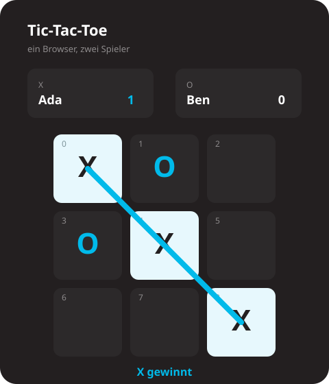

# Aufgabe

## Das Spiel

Tic-Tac-Toe. Zwei Personen, ein Browser. Der Server merkt sich nicht, wer vor dem Bildschirm sitzt. Der Client schickt beide User-Ids.

Neun Felder, Index `0` bis `8`, Zeile für Zeile. Ein Feld ist leer, `X` oder `O`. `X` beginnt. Ein Zug schickt nur die Feldnummer. Das Zeichen nimmt der Server aus `next`.

Drei gleiche Zeichen in einer Zeile, Spalte oder Diagonale gewinnen. Ist das Brett voll und niemand hat drei, ist es unentschieden. Danach ist `next` leer. Ein belegtes Feld, der falsche Spieler oder ein beendetes Spiel werden abgewiesen.

Am Ende schreibt der Server zwei Zeilen in den Verlauf, eine pro User: gewonnen, verloren oder unentschieden.

Ada (X) gewinnt. Die Zahlen in den Feldern sind die Indizes.

## Auftrag

Umgesetzt. Dieselbe Architektur wie `POST /users`. Repository, Service, Router, im Paket `app/`. Die JSON-Formen stehen in `app/schemas.py`. Die Zeilen stehen in `app/domain/models.py`.

1. Profil anlegen und lesen. `POST /profiles` mit `ProfileCreate`. `GET /profiles`.
2. User lesen. `GET /users`.
3. Spiel anlegen und lesen. `POST /games` mit `GameCreate`. Zwei verschiedene User. `GET /games` und `GET /games/{game_id}`.
4. Zug. `POST /games/{game_id}/moves` mit `MoveCreate`. Feld `0` bis `8`. Abweisen, wenn das Spiel zu Ende ist, der falsche Spieler dran ist, oder das Feld belegt ist. Am Ende zwei Zeilen `ScoreHistoryResponse`, eine pro User.
5. Verlauf. `GET /scores`. Gewonnen, verloren und unentschieden aus diesen Zeilen zählen.
